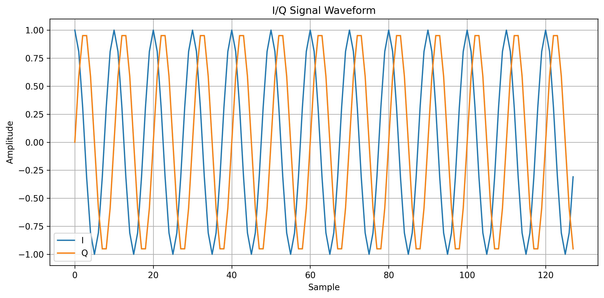
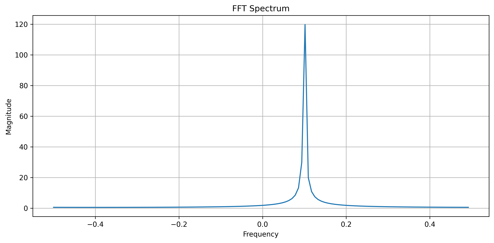
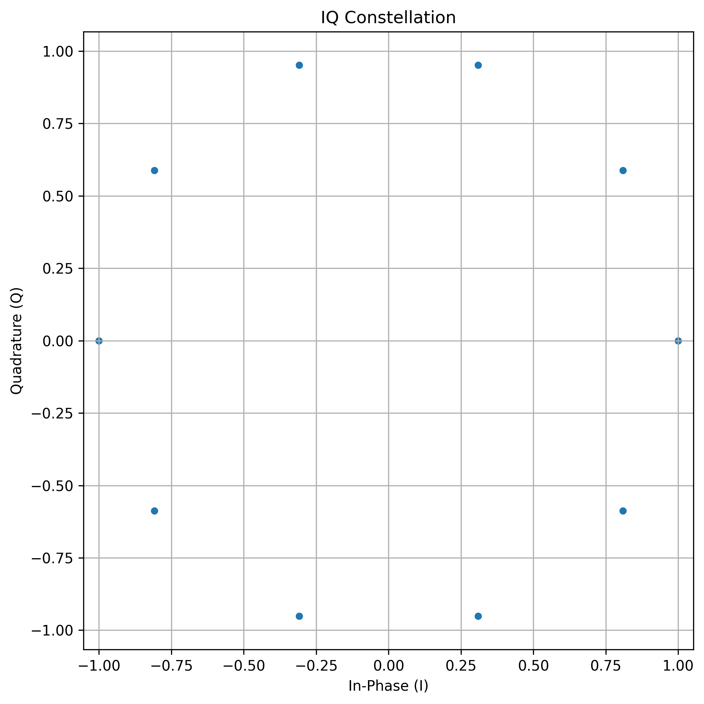
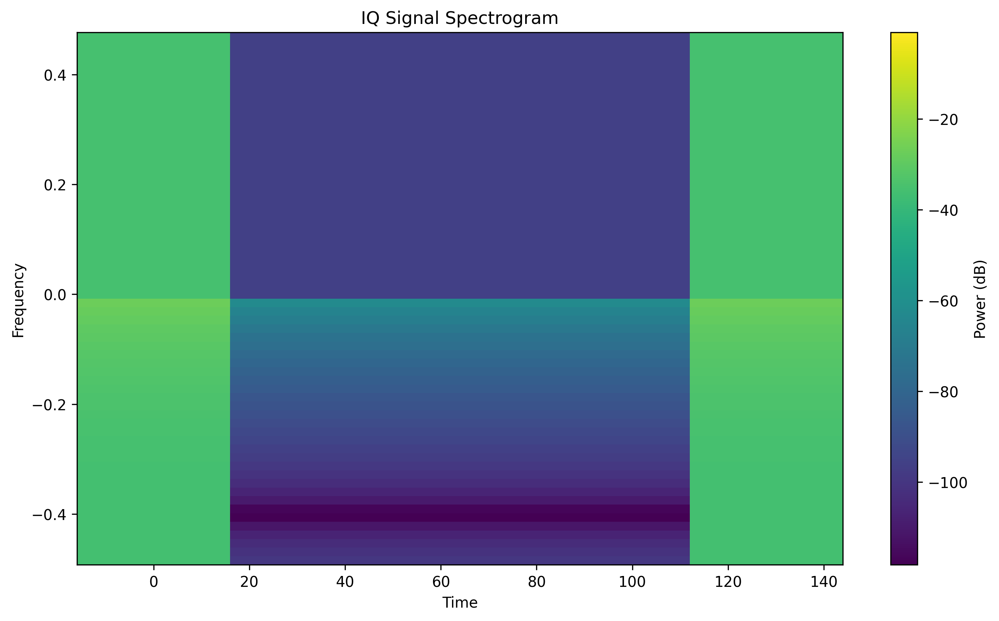

# AI Based Intelligent RF Spectrum Signal Identification System

An AI-based system for identifying and classifying RF signal modulation types using IQ signal data, signal processing, and Convolutional Neural Networks (CNN).

The project is developed using the RadioML 2016.10a dataset and is designed as a foundation for future real-time SDR-based RF signal identification.

---

## Tech Stack

### Programming & Development

<p align="left">
  
  
  
  
  
  
</p>

### Libraries & Tools


### Machine Learning


### Development Environment


## Project Overview

The system takes an RF/IQ signal and processes it through a machine-learning pipeline to identify its modulation type.

```text
IQ Signal
    ↓
Data Preprocessing
    ↓
Signal / Feature Processing
    ↓
CNN Model
    ↓
Modulation Classification
    ↓
Confidence Score
    ↓
Signal Visualization
```

The supported modulation classes are:

```text
8PSK
AM-DSB
AM-SSB
BPSK
CPFSK
GFSK
PAM4
QAM16
QAM64
QPSK
WBFM
```

---

## Main Objectives

- Analyze RF/IQ signal data.
- Preprocess and normalize IQ signals.
- Extract useful signal representations.
- Develop CNN-based modulation classifiers.
- Evaluate classification performance at different SNR levels.
- Predict the modulation type of individual IQ signals.
- Visualize RF signals using waveform, FFT, constellation, and spectrogram representations.
- Provide a foundation for future live SDR-based RF signal identification.

---

## Dataset

The project uses the:

```text
RadioML 2016.10a
```

dataset.

The processed test dataset contains:

```text
Test Samples: 44,000
Modulation Classes: 11
IQ Input: 2 × 128
```

The preprocessing pipeline creates separate:

```text
Training Data
Validation Data
Testing Data
```

---

## AI Model

The project includes CNN-based modulation classification.

The currently available trained model is:

```text
Improved CNN
```

The trained model is stored in:

```text
saved_models/
└── best_improved_cnn_classifier.keras
```

The model receives an IQ representation of:

```text
128 samples × 2 channels
```

and produces probabilities for the 11 modulation classes.

---

## Evaluation Results

The Improved CNN achieved:

| Metric | Result |
|---|---:|
| Overall Accuracy | **62.29%** |
| High-SNR Accuracy (≥ 0 dB) | **92.08%** |
| Low-SNR Accuracy (< 0 dB) | **32.39%** |

### Accuracy vs SNR


The result demonstrates that classification accuracy increases as signal quality improves.

### Confusion Matrix


The confusion matrix shows correct predictions along the diagonal and classification errors between different modulation classes.

### Normalized Confusion Matrix


The normalized matrix provides class-wise classification performance as proportions.

More detailed results are available in:

```text
evaluation/results/
```

---

## Signal Visualization

The project provides multiple visual representations of IQ signals.

### I/Q Waveform



Shows the In-phase and Quadrature components in the time domain.

### FFT Spectrum



Shows the frequency-domain representation of the signal.

### Constellation



Shows the distribution of IQ samples in the I-Q plane.

### Spectrogram



Shows the signal's power distribution across time and frequency.

Additional visualizations include:

```text
Amplitude
Phase
```

---

## Project Structure

```text
AI-Based-Intelligent-RF-Spectrum-Signal-Identification-System/
│
├── data/
│   ├── dataset/
│   └── processed/
│
├── features/
│   └── feature_extraction.py
│
├── models/
│   ├── cnn_model.py
│   └── improved_cnn.py
│
├── saved_models/
│   ├── best_improved_cnn_classifier.keras
│   └── final_improved_cnn_classifier.keras
│
├── evaluation/
│   ├── evaluate_model.py
│   └── results/
│
├── testing/
│   ├── predict.py
│   └── README.md
│
├── visualization/
│   ├── visualize_signal.py
│   └── results/
│
├── notebooks/
│   ├── 01_dataset_analysis.ipynb
│   ├── 02_data_preprocessing.ipynb
│   ├── 03_signal_visualization.ipynb
│   ├── 04_cnn_model.ipynb
│   ├── 05_model_training.ipynb
│   ├── 06_model_evaluation.ipynb
│   ├── 07_improved_cnn_model.ipynb
│   └── 08_improved_model_evaluation.ipynb
│
├── docs/
├── README.md
└── LICENSE
```

---

## Project Workflow

```text
RadioML 2016.10a
        ↓
Dataset Analysis
        ↓
Data Preprocessing
        ↓
IQ Normalization
        ↓
Feature / Signal Processing
        ↓
CNN Model Development
        ↓
Model Training
        ↓
Saved Trained Model
        ↓
Model Evaluation
        ↓
Individual Signal Testing
        ↓
Signal Visualization
        ↓
Final RF Identification System
```

---

## Running the Project

### Install Dependencies

Install the required Python packages:

```powershell
pip install -r requirements.txt
```

### Run Visualization

From the project root:

```powershell
python -m visualization.visualize_signal
```

### Run Signal Prediction

```powershell
python -m testing.predict
```

### Run Model Evaluation

```powershell
python -m evaluation.evaluate_model --model improved
```

Running modules from the project root keeps the project folders available as Python packages.

---

## Documentation

Detailed project documentation is available in:

```text
docs/
```

### Main Documentation

- [Project Overview](docs/project_overview.md)
- [Methodology](docs/methodology.md)
- [Dataset Information](docs/dataset_information.md)
- [Preprocessing](docs/preprocessing.md)
- [Feature Extraction](docs/feature_extraction.md)
- [Model Architecture](docs/model_architecture.md)
- [Training](docs/training.md)
- [Evaluation](docs/evaluation.md)
- [Prediction](docs/prediction.md)
- [Software Architecture](docs/software_architecture.md)
- [System Architecture](docs/system_architecture.md)
- [Hardware Integration](docs/hardware_integration.md)
- [Workflow](docs/workflow.md)

---

## Current System Status

### Completed

```text
[✓] Dataset analysis
[✓] Data preprocessing
[✓] IQ normalization
[✓] Feature extraction
[✓] CNN model development
[✓] Improved CNN development
[✓] Model training
[✓] Model evaluation
[✓] SNR performance analysis
[✓] Confusion matrix analysis
[✓] Individual signal testing
[✓] Signal visualization
[✓] GitHub project organization
```

### Current Model

```text
Improved CNN
Overall Accuracy: 62.29%
High-SNR Accuracy: 92.08%
Low-SNR Accuracy: 32.39%
```

---

## Future Hardware Integration

The current system works with stored IQ signals.

The planned hardware extension is:

```text
RTL-SDR / SDR Hardware
          ↓
      RF Signal
          ↓
      IQ Samples
          ↓
     Preprocessing
          ↓
      Improved CNN
          ↓
 Modulation Prediction
          ↓
 Confidence Score
          ↓
Spectrum + Spectrogram + Constellation
          ↓
     Live Interface
```

The hardware integration is documented in:

[Hardware Integration](docs/hardware_integration.md)

---

## Final Demonstration Concept

The final software interface is intended to combine signal acquisition, visualization, and AI classification.

```text
┌──────────────────────────────────────────┐
│       AI BASED RF SIGNAL SYSTEM          │
├──────────────────┬───────────────────────┤
│ Time Domain      │ Frequency Spectrum    │
│                  │                       │
├──────────────────┼───────────────────────┤
│ Spectrogram      │ Constellation         │
│                  │                       │
├──────────────────┴───────────────────────┤
│ Predicted Modulation : QPSK              │
│ Confidence           : XX.XX %           │
└──────────────────────────────────────────┘
```

The final system can later receive live IQ samples from SDR hardware.

---

## Project Status

The machine-learning and software analysis pipeline is functional.

The current project stage is:

```text
Dataset
    ↓
Preprocessing
    ↓
Feature Processing
    ↓
CNN
    ↓
Training
    ↓
Evaluation
    ↓
Testing
    ↓
Visualization
    ↓
Hardware Integration
```

The next major development stage is **live SDR acquisition and integration with the trained classification pipeline**.

---
## Team Members

| Member | Role | GitHub |
|---|---|---|
| **SUJAN G S** | Project Lead / ML Development | [GitHub](https://github.com/OjasFlux) |
| **N S YOGESH** | Testing & System Integration | [GitHub](https://github.com/Yogesh077X) |
| **SINDHU JIDDI** | Data & Signal Processing | [GitHub](https://github.com/sindhuuujiddi-png) |
| **RAMYA G R** | Model Development & Evaluation | [GitHub](https://github.com/shaivaramya437-ui) |


### Team Contributions

```text
Dataset & Preprocessing
        ↓
Signal Processing
        ↓
CNN Model Development
        ↓
Training & Evaluation
        ↓
Testing & Visualization
        ↓
System Integration
```

## License

See the [LICENSE](LICENSE) file for license information.
