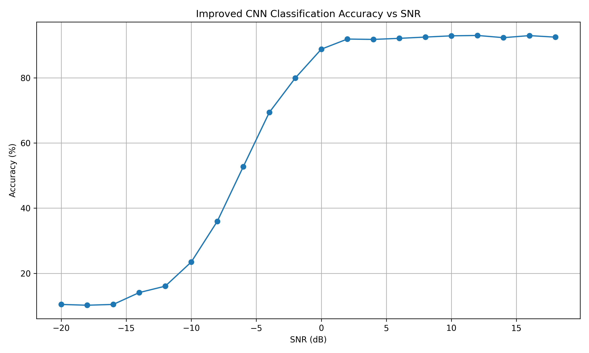
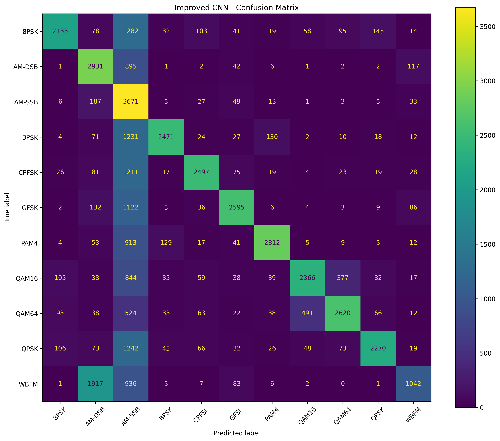
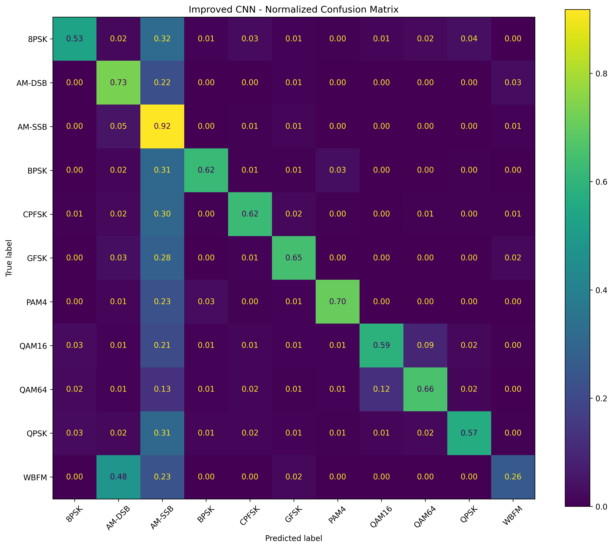

# Evaluation Results

## 1. Accuracy vs SNR



This graph shows how the Improved CNN classification accuracy changes with SNR.

- At low SNR, noise makes modulation classification difficult.
- As SNR increases, the signal becomes clearer.
- Classification accuracy improves significantly at higher SNR.

---

## 2. Confusion Matrix




The confusion matrix shows the actual modulation classes against the predicted classes.

- Diagonal values represent correct predictions.
- Off-diagonal values represent misclassifications.
- It helps identify which modulation types are difficult for the model to distinguish.

---

## 3. Normalized Confusion Matrix



The normalized confusion matrix shows the classification performance as proportions for each true modulation class.

- Values closer to `1.00` on the diagonal indicate better classification.
- Lower diagonal values indicate more classification errors.
- Off-diagonal values show which classes are being confused.

---

## Summary

The three visualizations provide a quick view of the Improved CNN performance:

```text
Accuracy vs SNR
        ↓
Performance under different signal conditions

Confusion Matrix
        ↓
Correct and incorrect classifications

Normalized Confusion Matrix
        ↓
Class-wise classification performance
```

These results are used to assess the Improved CNN before integrating it into the final RF signal identification system.
