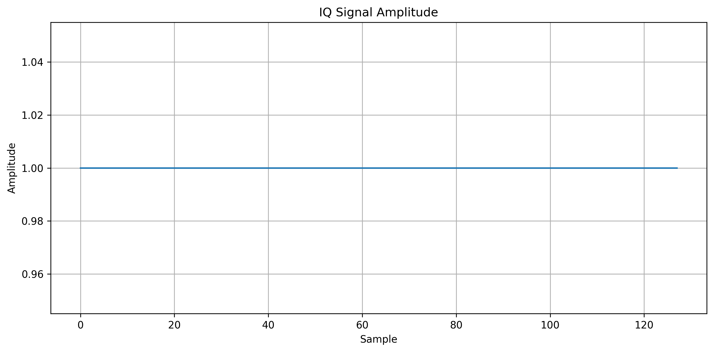
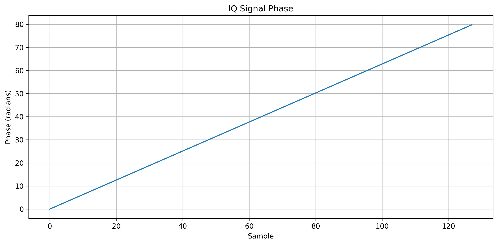

# Signal Visualization Results

This directory contains visual representations of the RF/IQ signal generated by the visualization module.

## 1. I/Q Waveform


Shows the In-phase (I) and Quadrature (Q) components of the signal over the samples.

It helps visualize the signal variation in the time domain.

---

## 2. FFT Spectrum


Shows the frequency-domain representation of the IQ signal.

It helps observe the frequency distribution and dominant frequency components.

---

## 3. Constellation Diagram


Shows the distribution of IQ samples in the I-Q plane.

It provides a visual representation of the signal's modulation characteristics.

---

## 4. Spectrogram


Shows how the signal power is distributed across frequency over time.

It provides a time-frequency representation of the RF signal.

---

## 5. Amplitude



Shows the instantaneous magnitude of the IQ signal over the samples.

It helps observe changes in signal strength.

---

## 6. Phase



Shows the phase variation of the IQ signal over the samples.

It helps visualize changes in the phase characteristics of the signal.

---

## Overall Visualization

The generated visualizations provide different views of the same IQ signal:

```text
IQ Signal
   │
   ├── Time Domain → I/Q Waveform
   │
   ├── Frequency Domain → FFT Spectrum
   │
   ├── I-Q Plane → Constellation
   │
   ├── Time + Frequency → Spectrogram
   │
   ├── Signal Strength → Amplitude
   │
   └── Phase Behavior → Phase
```

These visualizations will later be used together with the CNN prediction and confidence score in the final RF spectrum signal identification interface.
